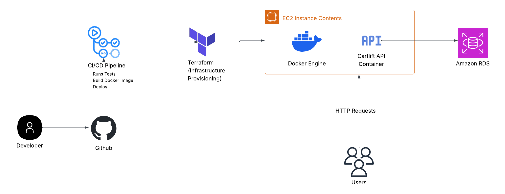

# CartLift E-commerce API

CartLift is a production-style e-commerce backend API built with Node.js and Express.  
This project is being developed as a DevOps portfolio project with Docker, GitHub Actions, Terraform, and AWS deployment.

## Features
- Health check endpoint
- Product listing endpoint
- Single product lookup endpoint
- Product creation endpoint
- PostgreSQL integration
- Dockerized local development
- Docker Compose support

## Endpoints
- GET /health
- GET /products
- GET /products/:id
- POST /products

## Architecture Diagram



## Sample Request Body

```json
{
  "name": "Laptop Stand",
  "description": "Adjustable aluminum laptop stand",
  "price": 39.99,
  "stock": 15
}
```

## Tech Stack

- Node.js
- Express
- PostgreSQL
- Docker
- Docker Compose
- GitHub Actions
- Terraform
- AWS

## Run locally
```bash
npm install
npm start
```

## Run with Docker compose
```bash
docker compose up --build
```

## Environment Variables 
Create a .env file using .env.example

## Project Goal
Build and deploy a production-style e-commerce API through a complete DevOps pipeline with containerization, CI/CD, infrastructure as code, and AWS hosting.